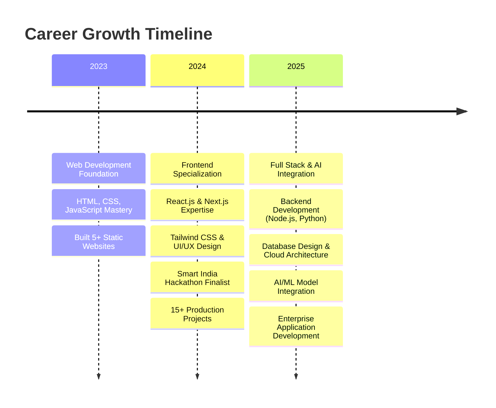

# 👋 Hi, I'm Anish Seth

### Full Stack Developer | AI/ML Enthusiast | UI/UX Designer

---

## 🚀 About Me

I'm a **Computer Science Engineering** student at Techno Main Salt Lake, passionate about building innovative digital solutions. I specialize in full-stack development with a strong focus on creating intuitive user experiences and leveraging AI/ML technologies.

### 💼 What I Do

- 🎨 **Full Stack Development**: Building scalable web applications with React, Next.js, and Node.js
- 🤖 **AI/ML Integration**: Developing intelligent solutions using modern ML frameworks
- 🎯 **UI/UX Design**: Creating user-centric interfaces with Tailwind CSS and Figma
- 🏆 **Smart India Hackathon 2024 Finalist**

### 🌱 Currently

- Building AI-powered applications and scalable systems
- Exploring cloud architecture and DevOps practices
- Contributing to open source projects
- Available for freelance projects and collaborations

---

## 🛠️ Tech Stack

### Languages

### Frontend

### Backend

### Database & Cloud

### Tools & Design

---

## 📊 GitHub Stats

  
  
  
  

  

---

## 🚀 Featured Projects

### 🤖 AI Chatbot Ticketing System
**Tech Stack:** React.js, FastAPI, Node.js, MongoDB, Google Dialogflow

A revolutionary AI-powered ticketing platform with intelligent multilingual chatbot support and real-time seat management.

**Key Features:**
- 🌐 Smart multilingual support via Google Dialogflow
- ⚡ Real-time seat management with live updates
- 📱 Progressive Web App with offline capabilities
- 🔐 Secure payment gateway integration
- 📊 Advanced analytics dashboard

[View Demo](#) | [Source Code](https://github.com/Anish-2005)

---

### ⚖️ Legal AI Assistant
**Tech Stack:** Next.js, Python, TensorFlow, PostgreSQL, GPT-4

Next-generation legal research platform powered by advanced AI for intelligent document analysis and automated legal assistance.

**Key Features:**
- 🔍 Intelligent legal research with semantic search
- 📋 Automated document analysis & summarization
- 📝 Smart contract generator with templates
- 💬 24/7 legal consultation chatbot
- 📊 Case outcome prediction using ML

[View Progress](https://github.com/Anish-2005) | [Documentation](#)

---

## 🏆 Achievements

- 🥇 **Smart India Hackathon 2024 Finalist**
- 🚀 **25+ Projects Completed**
- 📚 **Active Open Source Contributor**
- 🎓 **Computer Science Engineering Student**

---

## 📈 Professional Journey

---

## 🤝 Let's Connect

I'm always open to interesting conversations and collaboration opportunities!

**📧 Email:** [anishseth0510@gmail.com](mailto:anishseth0510@gmail.com)  
**💼 LinkedIn:** [Anish Seth](https://www.linkedin.com/in/anish-seth-202200290/)  
**🌐 Portfolio:** [portfolio-anish-seth-1.vercel.app](https://portfolio-anish-seth-1.vercel.app/)  
**🐦 Twitter:** [@AnishSeth170734](https://x.com/AnishSeth170734)

### Open to:
- 💼 Freelance Projects
- 🤝 Collaboration Opportunities
- 🎯 Full-time Positions
- 🌱 Mentoring & Knowledge Sharing

---

### 💡 "Building the future, one line of code at a time"

**Made with ❤️ by Anish Seth**

