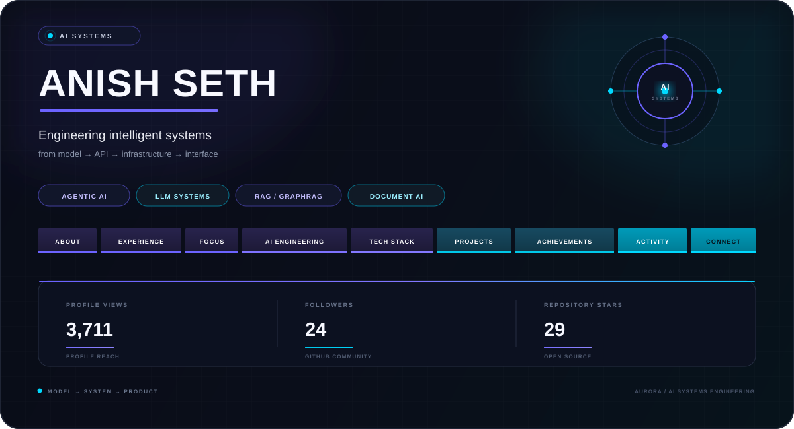
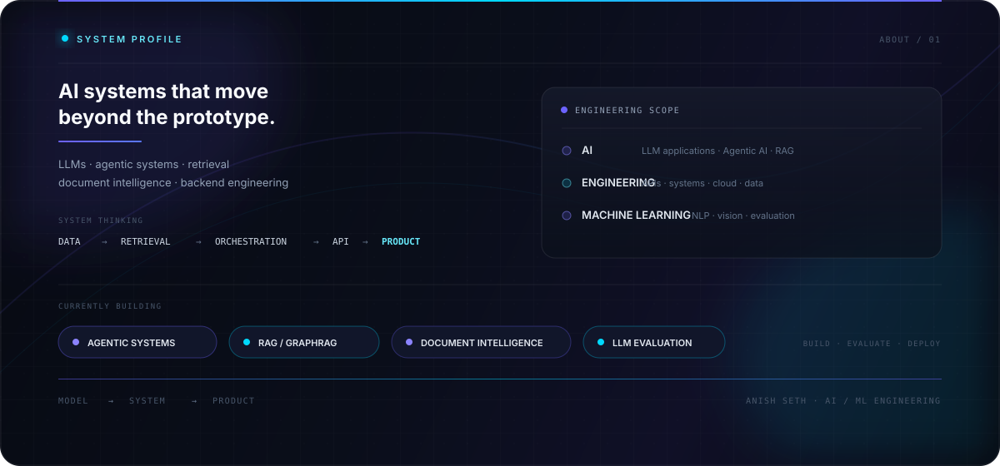
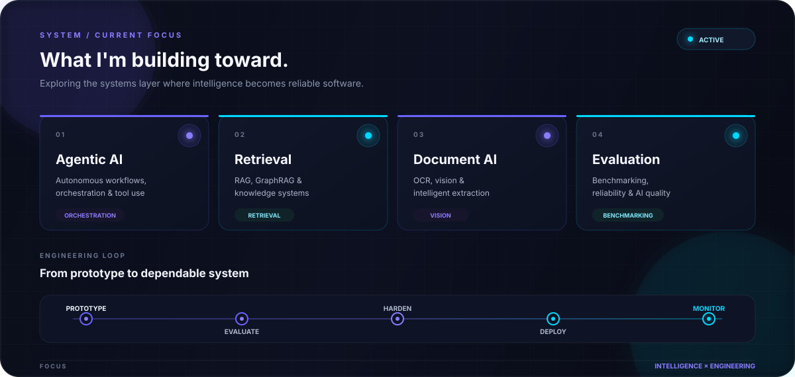
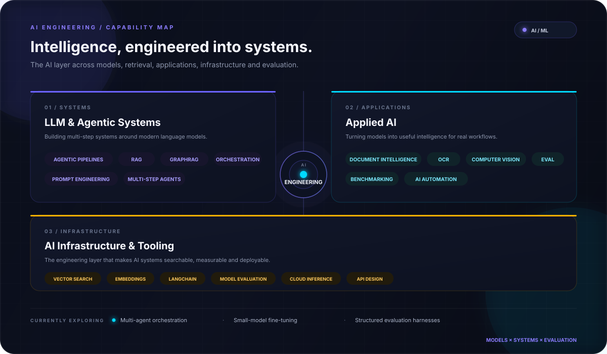
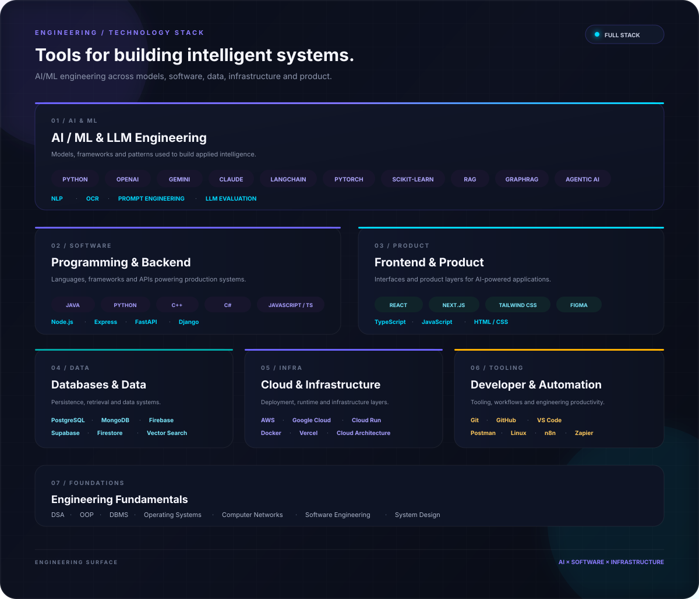
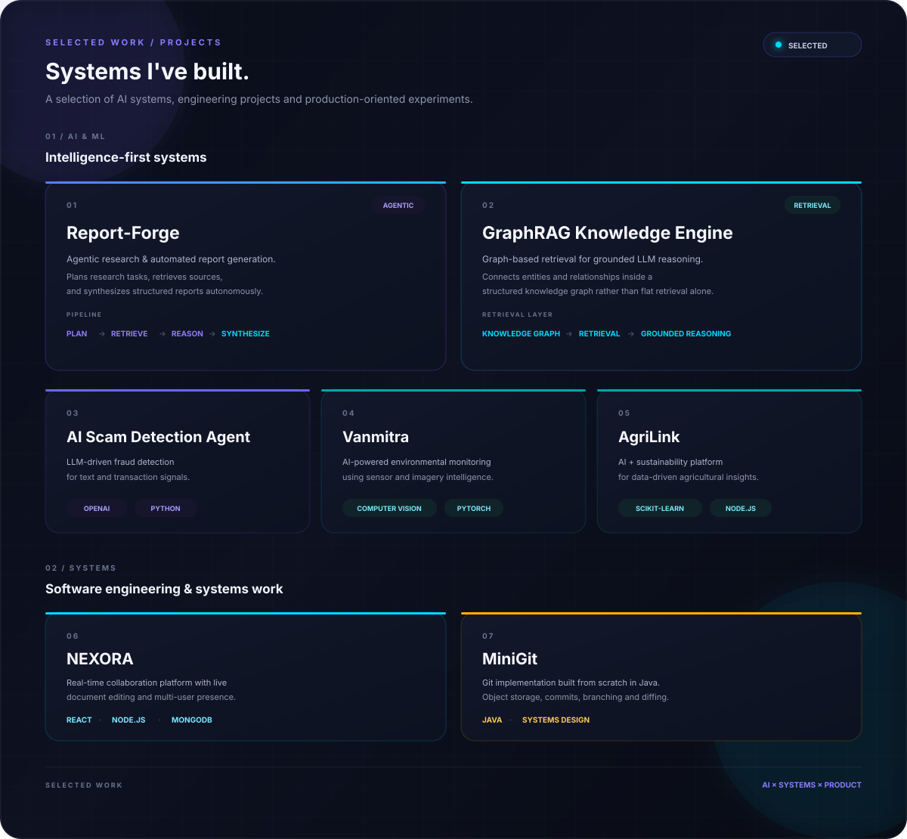
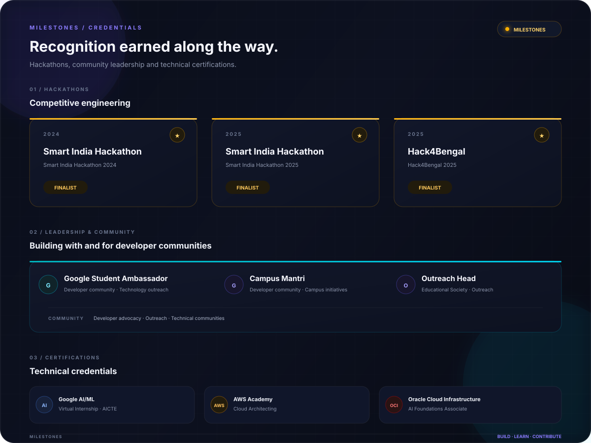
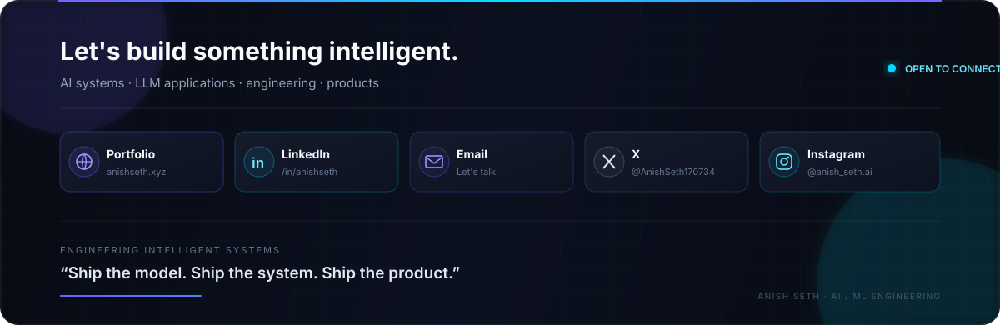

<!-- ═══════════════════════════════════════════════════════════════════════════════ -->
<!-- ANISH SETH — GITHUB PROFILE README · Design System: "Aurora"                  -->
<!-- Palette → Violet #6C63FF · Cyan #00D9FF · Ink #0A0E1A                     -->
<!-- Header → Repository-hosted SVG · Navigation → Native GitHub anchors          -->
<!-- ═══════════════════════════════════════════════════════════════════════════════ -->

<!-- ═══════════════════════════════════════════════════════════════════════ -->
<!-- 🧠 ABOUT -->
<!-- ═══════════════════════════════════════════════════════════════════════ -->

## 🧠 About Me

 

> **I build AI systems that move beyond the prototype.**
>
> My work sits at the intersection of **LLMs, agentic systems, retrieval, document intelligence, and backend engineering** — turning research ideas into systems that can actually be evaluated, deployed, and used.

I'm currently working as an **AI/ML Engineering Intern**, building agentic research and report-generation systems alongside document-intelligence and LLM evaluation workflows.

My foundation is in **full-stack engineering**, which shapes how I approach AI: I think beyond the model itself — from **data and retrieval → orchestration → APIs → infrastructure → user-facing products**.

 

`Agentic Systems` · `RAG / GraphRAG` · `Document Intelligence` · `LLM Evaluation`

<!-- ═══════════════════════════════════════════════════════════════════════ -->
<!-- 💼 EXPERIENCE -->
<!-- ═══════════════════════════════════════════════════════════════════════ -->

## 💼 Experience

 

> **I build AI systems with a software-engineering mindset.**
>
> My experience spans **agentic AI, LLM systems, document intelligence, evaluation, backend engineering, and cloud deployment** — backed by a full-stack foundation that lets me work across the entire system rather than only the model layer.
<!-- ═══════════════════════════════════════════════════════════════════════ -->
<!-- 🎯 CURRENT FOCUS -->
<!-- ═══════════════════════════════════════════════════════════════════════ -->

## 🎯 Current Focus

 

> **The goal isn't just to make AI work. It's to make AI systems reliable enough to ship.**

<!-- ═══════════════════════════════════════════════════════════════════════ -->
<!-- 🤖 AI ENGINEERING -->
<!-- ═══════════════════════════════════════════════════════════════════════ -->

## 🤖&nbsp; AI Engineering

 

> **Engineering the layer between models and real-world systems.**
>
> I work across **LLM applications, agentic workflows, retrieval, document intelligence, evaluation, and AI infrastructure** — with an emphasis on systems that can be measured, integrated, and deployed.

<!-- ═══════════════════════════════════════════════════════════════════════ -->
<!-- 🛠️ TECH STACK -->
<!-- ═══════════════════════════════════════════════════════════════════════ -->

## 🛠️ Tech Stack

 

> **A full-stack foundation for AI engineering.**
>
> I work across **models → retrieval → orchestration → APIs → data → infrastructure → product**, using the stack required to take an intelligent system from idea to deployment.
<!-- ═══════════════════════════════════════════════════════════════════════ -->
<!-- 🚀 PROJECTS -->
<!-- ═══════════════════════════════════════════════════════════════════════ -->

## 🚀&nbsp; Featured Projects

 

◈ More projects, live demos &amp; technical work on
<a href="https://www.anishseth.xyz"><b>anishseth.xyz</b></a>

<!-- ═══════════════════════════════════════════════════════════════════════ -->
<!-- 🏆 ACHIEVEMENTS -->
<!-- ═══════════════════════════════════════════════════════════════════════ -->

## 🏆&nbsp; Achievements & Certifications

<!-- ═══════════════════════════════════════════════ ACTIVITY ═══════════════════════════════════════════════ -->

## 📊&nbsp; GitHub Activity

<!-- ═══════════════════════════════════════════════ CONNECT ═══════════════════════════════════════════════ -->

