```mermaid
mindmap
  root((🤝 Connect<br/>With Me))
    🔗 Professional
      💼 LinkedIn
      📧 Email
      🌐 Portfolio
    🎨 Creative
      📸 Instagram
      🐦 Twitter
      🎥 YouTube
    💻 Developer
      🐙 GitHub
      📚 Dev.to
      💬 Discord
    🎓 Learning
      📖 Medium
      🎤 Speaker
      👨‍🏫 Mentor
```

<div align="center">

  

</div><div align="center">

  

<div align="center"></div>

  

</div><div align="center">

  <br>

<!-- Animated Tech Stack Wave -->  

<div align="center">  <br><br>

    

</div>  

  

<br>  <br><br>

  

<div align="center"></div>

  

  <br><br><div align="center">

    <br>

    

  <!-- Animated Badge Collection -->

  <br><br><p>

    

</div>  

  

<div align="center"></p>

  <br>

  <!-- Social Links with Hover Effects -->

<!-- Animated Badge Collection --><p>

<p>  <a href="https://github.com/Anish-2005">

      

    </a>

    <a href="https://www.linkedin.com/in/anish-seth-202200290/">

      

</p>  </a>

  <a href="https://portfolio-anish-seth-1.vercel.app/">

<!-- Social Links with Hover Effects -->    

<p>  </a>

  <a href="https://github.com/Anish-2005">  <a href="mailto:anishseth0510@gmail.com">

        

  </a>  </a>

  <a href="https://www.linkedin.com/in/anish-seth-202200290/">  <a href="https://x.com/AnishSeth170734">

        

  </a>  </a>

  <a href="https://portfolio-anish-seth-1.vercel.app/"></p>

    

  </a><!-- Inspirational Quote with Animation -->

  <a href="mailto:anishseth0510@gmail.com"><div align="center">

      

  </a></div>

  <a href="https://x.com/AnishSeth170734">

    <!-- Dynamic Stats Display -->

  </a><br>

</p><div align="center">

  

<!-- Inspirational Quote with Animation -->  

<div align="center">  

  </div>

</div>

<!-- Floating Elements Animation -->

<!-- Dynamic Stats Display -->

<br>

<div align="center">

  </div>

  

  <br><br>

</div>

<div align="center">

<!-- Floating Elements Animation -->  

</div>


<div align="center">

</div>  

</div>

<br><br><br>

<!-- Animated Cards Layout -->

---<div align="center">

  

<div align="center">  <div align="center">

      

</div>    <h3>🎯 Current Focus</h3>

  </div>

<div align="center">  

    <!-- Beautiful Current Focus Table -->

</div>  <table align="center">

    <tr>

<!-- Developer Persona Diagram -->      <td align="center" width="50%">

<div align="center">        

          <br>

</div>        <strong>🎓 Education</strong>

        <br>

<br>        <sub>Computer Science Engineering<br>@ Techno Main Salt Lake</sub>

      </td>

<!-- Animated Cards Layout -->      <td align="center" width="50%">

<div align="center">        

          <br>

  <div align="center">        <strong>🌱 Currently Learning</strong>

            <br>

    <h3>🎯 Current Focus</h3>        <sub>React.js, Next.js, Node.js & AI/ML</sub>

  </div>      </td>

      </tr>

  <!-- Beautiful Current Focus Table -->    <tr>

  <table align="center">      <td align="center">

    <tr>        

      <td align="center" width="50%">        <br>

                <strong>🔭 Building</strong>

        <br>        <br>

        <strong>🎓 Education</strong>        <sub>AI-powered solutions &<br>scalable applications</sub>

        <br>      </td>

        <sub>Computer Science Engineering<br>@ Techno Main Salt Lake</sub>      <td align="center">

      </td>        

      <td align="center" width="50%">        <br>

                <strong>👯 Open to</strong>

        <br>        <br>

        <strong>🌱 Currently Learning</strong>        <sub>Collaborations on<br>innovative projects</sub>

        <br>      </td>

        <sub>React.js, Next.js, Node.js & AI/ML</sub>    </tr>

      </td>    <tr>

    </tr>      <td align="center">

    <tr>        

      <td align="center">        <br>

                <strong>💬 Expertise</strong>

        <br>        <br>

        <strong>🔭 Building</strong>        <sub>Full Stack Development<br>& UI/UX Design</sub>

        <br>      </td>

        <sub>AI-powered solutions &<br>scalable applications</sub>      <td align="center">

      </td>        

      <td align="center">        <br>

                <strong>⚡ Hobbies</strong>

        <br>        <br>

        <strong>👯 Open to</strong>        <sub>Photography &<br>Graphic Design 📸</sub>

        <br>      </td>

        <sub>Collaborations on<br>innovative projects</sub>    </tr>

      </td>    <tr>

    </tr>      <td align="center" colspan="2">

    <tr>        

      <td align="center">        <br>

                <strong>� Contact Me</strong>

        <br>        <br>

        <strong>💬 Expertise</strong>        <sub><a href="mailto:anishseth0510@gmail.com">anishseth0510@gmail.com</a></sub>

        <br>      </td>

        <sub>Full Stack Development<br>& UI/UX Design</sub>    </tr>

      </td>  </table>

      <td align="center">  <br><br>

        

        <br>  <div align="center">

        <strong>⚡ Hobbies</strong>    

        <br>    <h3>🌟 Goals & Vision</h3>

        <sub>Photography &<br>Graphic Design 📸</sub>  </div>

      </td>  

    </tr>  <!-- Beautiful Goals & Vision Table -->

    <tr>  <table align="center">

      <td align="center" colspan="2">    <tr>

              <td align="center" width="50%">

        <br>        

        <strong>📧 Contact Me</strong>        <br>

        <br>        <strong>🏆 Achievement</strong>

        <sub><a href="mailto:anishseth0510@gmail.com">anishseth0510@gmail.com</a></sub>        <br>

      </td>        <sub>Smart India Hackathon 2024<br>Finalist</sub>

    </tr>      </td>

  </table>      <td align="center" width="50%">

        

  <!-- Coding Activity Chart -->        <br>

  <br><br>        <strong>🌐 Web Innovation</strong>

  <div align="center">        <br>

            <sub>Creating next-gen<br>web experiences</sub>

  </div>      </td>

    </tr>

  <br><br>    <tr>

      <td align="center">

  <div align="center">        

            <br>

    <h3>🌟 Goals & Vision</h3>        <strong>🤖 AI Pioneer</strong>

  </div>        <br>

          <sub>Pioneering AI-driven<br>solutions</sub>

  <!-- Beautiful Goals & Vision Table -->      </td>

  <table align="center">      <td align="center">

    <tr>        

      <td align="center" width="50%">        <br>

                <strong>🨠UI/UX Design</strong>

        <br>        <br>

        <strong>🏆 Achievement</strong>        <sub>Designing intuitive<br>user interfaces</sub>

        <br>      </td>

        <sub>Smart India Hackathon 2024<br>Finalist</sub>    </tr>

      </td>    <tr>

      <td align="center" width="50%">      <td align="center">

                

        <br>        <br>

        <strong>🌐 Web Innovation</strong>        <strong>📱 Mobile First</strong>

        <br>        <br>

        <sub>Creating next-gen<br>web experiences</sub>        <sub>Developing mobile-first<br>applications</sub>

      </td>      </td>

    </tr>      <td align="center">

    <tr>        

      <td align="center">        <br>

                <strong>🚀 Open Source</strong>

        <br>        <br>

        <strong>🤖 AI Pioneer</strong>        <sub>Contributing to<br>open source ecosystem</sub>

        <br>      </td>

        <sub>Pioneering AI-driven<br>solutions</sub>    </tr>

      </td>    <tr>

      <td align="center">      <td align="center" colspan="2">

                

        <br>        <br>

        <strong>🎨 UI/UX Design</strong>        <strong>📚 Lifelong Learning</strong>

        <br>        <br>

        <sub>Designing intuitive<br>user interfaces</sub>        <sub>Continuous learner & tech explorer</sub>

      </td>      </td>

    </tr>    </tr>

    <tr>  </table>

      <td align="center">

          <div align="center">

        <br>    

        <strong>📱 Mobile First</strong>  </div>

        <br>

        <sub>Developing mobile-first<br>applications</sub></div>

      </td>

      <td align="center"><!-- Floating Achievement Badges -->

        <div align="center">

        <br>  

        <strong>🚀 Open Source</strong>  

        <br>  

        <sub>Contributing to<br>open source ecosystem</sub>  

      </td></div>

    </tr>

    <tr>---

      <td align="center" colspan="2">

        <div align="center">

        <br>  

        <strong>📚 Lifelong Learning</strong></div>

        <br>

        <sub>Continuous learner & tech explorer</sub><div align="center">

      </td>  

    </tr></div>

  </table>

<!-- Interactive Tech Stack Display -->

  <br><br><div align="center">


  <!-- Development Workflow Diagram -->### 🌟 **Programming Languages**

  <div align="center"><p>

    <h3>💡 My Development Workflow</h3>  

    </p>

  </div>

### 🚀 **Frameworks & Libraries**

  <br><p>

  

  <div align="center"></p>

    

  </div>### 🗄️ **Databases & Cloud**

<p>

</div>  

</p>

<!-- Floating Achievement Badges -->

<div align="center">### 🛠️ **Tools & Platforms**

  <p>

    

  </p>

  

  </div>

</div>

<!-- Animated Progress Bars -->

---<div align="center">

  <h2>📊 Skill Proficiency Matrix</h2>

<div align="center">  

    <div align="center">

</div>    

    <h3>🎨 Frontend Mastery</h3>

<div align="center">

      

</div>| React.js | Next.js | JavaScript |

|:---:|:---:|:---:|

<!-- Interactive Tech Stack Diagram -->|  <br> **95%** <br> `███████████` |  <br> **90%** <br> `██████████░` |  <br> **95%** <br> `███████████` |

<div align="center">| TypeScript | CSS/SCSS | Tailwind CSS |

  |  <br> **85%** <br> `█████████░░` |  <br> **90%** <br> `██████████░` |  <br> **95%** <br> `███████████` |

</div>  </div>


<br>  <br>


<!-- Tech Stack Architecture Diagram -->  <div align="center">

<div align="center">    

      <h3>⚙️ Backend Excellence</h3>

```mermaid

graph TB    

    A[🎨 Frontend] --> B[⚛️ React.js]| Node.js | Python | Django/Flask |

    A --> C[🚀 Next.js]|:---:|:---:|:---:|

    A --> D[🭠Tailwind CSS]|  <br> **85%** <br> `█████████░░` |  <br> **90%** <br> `██████████░` |  <br> **80%** <br> `████████░░░` |

    | MongoDB | MySQL | REST APIs |

    E[⚙️ Backend] --> F[🟢 Node.js]|  <br> **85%** <br> `█████████░░` |  <br> **80%** <br> `███████░░░░` |  <br> **90%** <br> `██████████░` |

    E --> G[🐍 Python]  </div>

    E --> H[🔥 Django/Flask]

      <br>

    I[🗄️ Database] --> J[🍃 MongoDB]

    I --> K[🐬 MySQL]</div>

    I --> L[🔄 Redis]

    <!-- Tech Stats Visualization -->

    M[☁️ Cloud & DevOps] --> N[📦 Docker]<div align="center">

    M --> O[☁️ AWS/GCP]  <h3>📊 Development Activity Heatmap</h3>

    M --> P[🔄 CI/CD]  

    </div>

    Q[🤖 AI/ML] --> R[🧠 TensorFlow]

    Q --> S[🔮 OpenAI]<!-- Interactive Badges -->

    Q --> T[💬 NLP]<div align="center">

      <h3>🏆 Technology Badges</h3>

    style A fill:#FF6B6B  

    style E fill:#4ECDC4  

    style I fill:#FFE66D  

    style M fill:#95E1D3  

    style Q fill:#A8E6CF</div>

```

---

</div>

<div align="center">

<br>  

</div>

<!-- Interactive Tech Stack Display -->

<div align="center"><div align="center">

  

### 🌟 **Programming Languages**</div>

<p>

  <!-- Enhanced Stats Layout -->

</p><div align="center">

  

### 🚀 **Frameworks & Libraries**  

<p>  

  </div>

</p>

<div align="center">

### 🗄️ **Databases & Cloud**  

<p>  

    

</p></div>


### 🛠️ **Tools & Platforms**<!-- Trophy Display -->

<p><div align="center">

    <h3>🆠GitHub Trophy Collection</h3>

</p>  

</div>

</div>

<!-- Contribution Graph -->

<!-- Animated Progress Bars --><div align="center">

<div align="center">  <h3>📈 Contribution Activity Graph</h3>

  <h2>📊 Skill Proficiency Matrix</h2>  

  </div>

  <div align="center">

    ---

    <h3>🎨 Frontend Mastery</h3>

    <div align="center">

|  React.js |  Next.js |  JavaScript |  

|:---:|:---:|:---:|</div>

|  |  |  |

| ** TypeScript** | ** CSS/SCSS** | ** Tailwind CSS** |<div align="center">

|  |  |  |  

  </div></div>


  <br><!-- Interactive Project Cards -->

<div align="center">

  <div align="center">  

    

    <h3>⚙️ Backend Excellence</h3>  <!-- AI Chatbot Ticketing System Card -->

      <div align="center">

|  Node.js |  Python |  Django/Flask |    

|:---:|:---:|:---:|    <h2>🤖 AI Chatbot Ticketing System</h2>

|  |  |  |    

| ** MongoDB** | ** MySQL** | ** REST APIs** |    

|  |  |  |    

  </div>    <br><br>

    <strong>🚀 Revolutionary AI-powered ticketing platform</strong> that transforms the booking experience with intelligent multilingual chatbot support and seamless user interactions.

  <br>    <br><br>

    <table>

  <!-- Skills Radar Chart -->      <tr>

  <div align="center">        <th>✨ Key Innovations</th>

    <h3>📈 Skills Distribution</h3>        <th>🛠️ Technology Stack</th>

          </tr>

  </div>      <tr>

        <td align="left" valign="top">

</div>          <ul>

            <li>🌐 <b>Smart Multilingual Support</b> via Google Dialogflow</li>

<!-- Tech Stats Visualization -->            <li>⚡ <b>Real-time Seat Management</b> with live updates</li>

<div align="center">            <li>📱 <b>Progressive Web App</b> with offline capabilities</li>

  <h3>📊 Development Activity Heatmap</h3>            <li>🔐 <b>Secure Payment Gateway</b> integration</li>

              <li>📊 <b>Advanced Analytics Dashboard</b> for insights</li>

</div>            <li>🎯 <b>Personalized Recommendations</b> engine</li>

          </ul>

<!-- Interactive Badges -->        </td>

<div align="center">        <td align="left" valign="top">

  <h3>🏆 Technology Badges</h3>          <ul>

              <li><b>Frontend:</b> React.js, Tailwind CSS, PWA</li>

              <li><b>Backend:</b> FastAPI, Node.js, Django</li>

              <li><b>Database:</b> MongoDB, Redis</li>

              <li><b>AI:</b> Google Dialogflow, NLP</li>

              <li><b>Deploy:</b> Vercel, Railway, Docker</li>

</div>          </ul>

        </td>

---      </tr>

    </table>

<div align="center">    <br>

      <a href="https://github.com/Anish-2005">

</div>      

    </a>

<div align="center">    <a href="https://github.com/Anish-2005">

        

</div>    </a>

  </div>

<!-- GitHub Stats Showcase -->

<div align="center">  <br><br>

  

</div>  <!-- Legal AI Assistant Card -->

  <div align="center">

<br>    

    <h2>⚖️ Legal AI Assistant</h2>

<!-- Enhanced Stats Layout -->    

<div align="center">    

      

      <br><br>

      <strong>💡 Next-generation legal research platform</strong> powered by advanced AI algorithms for intelligent document analysis and automated legal assistance.

</div>    <br><br>

    <table>

<br>      <tr>

        <th>✨ AI-Powered Features</th>

<div align="center">        <th>�️ Technology Stack</th>

        </tr>

</div>      <tr>

        <td align="left" valign="top">

<br>          <ul>

            <li>�🔍 <b>Intelligent Legal Research</b> with semantic search</li>

<!-- Contribution Graph -->            <li>📋 <b>Automated Document Analysis</b> & summarization</li>

<div align="center">            <li>📝 <b>Smart Contract Generator</b> with templates</li>

  <h3>📈 Contribution Activity Graph</h3>            <li>💬 <b>24/7 Legal Consultation</b> chatbot</li>

              <li>📊 <b>Case Outcome Prediction</b> using ML</li>

</div>            <li>🎯 <b>Compliance Monitoring</b> automation</li>

          </ul>

<br>        </td>

        <td align="left" valign="top">

<!-- Trophy Display -->          <ul>

<div align="center">            <li><b>Frontend:</b> Next.js, React, TypeScript</li>

  <h3>🏆 GitHub Trophy Collection</h3>            <li><b>Backend:</b> Node.js, Express, Python</li>

              <li><b>Database:</b> MongoDB, PostgreSQL</li>

</div>            <li><b>AI/ML:</b> TensorFlow, spaCy, BERT</li>

            <li><b>API:</b> OpenAI GPT, Legal APIs</li>

<!-- GitHub Metrics -->            <li><b>Deploy:</b> AWS, Docker, Kubernetes</li>

<div align="center">          </ul>

  <h3>📊 Detailed GitHub Metrics</h3>        </td>

        </tr>

      </table>

      <br>

      <a href="https://github.com/Anish-2005">

</div>      

    </a>

---    <a href="https://github.com/Anish-2005">

      

<div align="center">    </a>

    </div>

</div>

</div>

<div align="center">

  <!-- Project Statistics -->

</div><div align="center">

  <h2>📊 Project Development Statistics</h2>

<!-- Project Architecture Diagram -->  

<div align="center">  

    

</div>  

</div>

<br>

---

<!-- Project Architecture Flow -->

<div align="center"><div align="center">

  

```mermaid</div>

flowchart LR

    A[👤 User Interface] -->|Interacts| B[⚛️ Frontend<br/>React/Next.js]<div align="center">

    B -->|API Calls| C[🔄 API Gateway]  

    C -->|Routes| D[⚙️ Backend<br/>Node.js/Python]</div>

    D -->|Queries| E[🗄️ Database<br/>MongoDB/MySQL]

    D -->|Processes| F[🤖 AI/ML<br/>Services]<!-- Enhanced Social Connection Grid -->

    F -->|Predictions| D

    D -->|Responses| C<div align="center">

    C -->|Updates| B  <table>

    B -->|Renders| A    <tr>

          <td align="center">

    style A fill:#FF6B6B        <a href="https://www.linkedin.com/in/anish-seth-202200290/" target="_blank">

    style B fill:#4ECDC4          <br>

    style C fill:#FFE66D          

    style D fill:#95E1D3        </a>

    style E fill:#A8E6CF        <br><sub>🤝 <b>Professional Network</b></sub>

    style F fill:#FFB6C1      </td>

```      <td align="center">

        <a href="https://x.com/AnishSeth170734" target="_blank">

</div>          <br>

          

<br>        </a>

        <br><sub>🐦 <b>Tech Updates</b></sub>

<!-- Interactive Project Cards -->      </td>

<div align="center">      <td align="center">

        <a href="https://instagram.com/anish_seth.ai" target="_blank">

  <!-- AI Chatbot Ticketing System Card -->          <br>

  <div align="center">          

            </a>

    <h2>🤖 AI Chatbot Ticketing System</h2>        <br><sub>📸 <b>Creative Content</b></sub>

          </td>

          <td align="center">

            <a href="mailto:anishseth0510@gmail.com" target="_blank">

    <br><br>          <br>

    <strong>🚀 Revolutionary AI-powered ticketing platform</strong> that transforms the booking experience with intelligent multilingual chatbot support and seamless user interactions.          

    <br><br>        </a>

            <br><sub>📧 <b>Direct Contact</b></sub>

<!-- Project System Architecture -->      </td>

```mermaid      <td align="center">

graph TD        <a href="https://portfolio-anish-seth-1.vercel.app/" target="_blank">

    A[🌠User] -->|Chats| B[💬 Chatbot Interface]          <br>

    B -->|NLP| C[🧠 Dialogflow AI]          

    C -->|Intent| D[🔄 Backend API]        </a>

    D -->|Query| E[(🗄️ MongoDB)]        <br><sub>🌐 <b>My Work</b></sub>

    D -->|Cache| F[(⚡ Redis)]      </td>

    D -->|Process| G[💳 Payment Gateway]    </tr>

    E -->|Seat Data| D  </table>

    F -->|Fast Access| D</div>

    D -->|Response| B

    B -->|Display| A<!-- Collaboration Call-to-Action -->

    <div align="center">

    style A fill:#FF6B6B  <h2>🚀 Ready to Build Something Amazing Together?</h2>

    style B fill:#4ECDC4  

    style C fill:#FFE66D  

    style D fill:#95E1D3  

    style E fill:#A8E6CF  <p>

    style F fill:#FFB6C1    

    style G fill:#DDA0DD    

```    

  </p>

<br>  

  <p>

<table>    

      <tr>    

        <th>✨ Key Innovations</th>    

        <th>🛠️ Technology Stack</th>  </p>

      </tr></div>

      <tr>

        <td align="left" valign="top"><!-- Interactive Contact Form -->

          <ul><div align="center">

            <li>🌐 <b>Smart Multilingual Support</b> via Google Dialogflow</li>  <h3>💌 Quick Connect</h3>

            <li>⚡ <b>Real-time Seat Management</b> with live updates</li>  

            <li>📱 <b>Progressive Web App</b> with offline capabilities</li>  <div align="center">

            <li>🔐 <b>Secure Payment Gateway</b> integration</li>    <h4>🚀 For Projects</h4>

            <li>📊 <b>Advanced Analytics Dashboard</b> for insights</li>    <p>Got an exciting project idea?<br>Let's bring it to life!</p>

            <li>🎯 <b>Personalized Recommendations</b> engine</li>    <a href="mailto:anishseth0510@gmail.com?subject=Project%20Collaboration">

          </ul>      

        </td>    </a>

        <td align="left" valign="top">  </div>

          <ul>  

            <li><b>Frontend:</b> React.js, Tailwind CSS, PWA</li>  <br>

            <li><b>Backend:</b> FastAPI, Node.js, Django</li>  

            <li><b>Database:</b> MongoDB, Redis</li>  <div align="center">

            <li><b>AI:</b> Google Dialogflow, NLP</li>    <h4>🤝 For Collaboration</h4>

            <li><b>Deploy:</b> Vercel, Railway, Docker</li>    <p>Want to work together?<br>I'm always open to partnerships!</p>

          </ul>    <a href="mailto:anishseth0510@gmail.com?subject=Collaboration%20Opportunity">

        </td>      

      </tr>    </a>

    </table>  </div>

    <br>  

    <a href="https://github.com/Anish-2005">  <br>

        

    </a>  <div align="center">

    <a href="https://github.com/Anish-2005">    <h4>💬 For Chat</h4>

          <p>Just want to say hi?<br>I love connecting with fellow developers!</p>

    </a>    <a href="mailto:anishseth0510@gmail.com?subject=Hello%20Anish">

    <a href="https://github.com/Anish-2005">      

          </a>

    </a>  </div>

  </div>  

</div>

  <br><br>

<!-- Snake Contribution Animation -->

  <!-- Legal AI Assistant Card --><div align="center">

  <div align="center">  <h2>🐍 Watch My Contributions Get Devoured!</h2>

      

    <h2>⚖️ Legal AI Assistant</h2></div>

    

    <!-- Final Wave Footer -->

    <div align="center">

    <br><br>  

    <strong>💡 Next-generation legal research platform</strong> powered by advanced AI algorithms for intelligent document analysis and automated legal assistance.</div>

    <br><br>

<!-- Closing Credits -->

<!-- AI Legal Assistant Architecture --><div align="center">

```mermaid  <h3>🌟 "The best way to predict the future is to create it." - Peter Drucker</h3>

graph TD  <p><strong>Keep coding, keep dreaming, keep inspiring! ✨</strong></p>

    A[👤 User Query] -->|Submit| B[💬 Chat Interface]  

    B -->|Process| C[🧠 AI Engine<br/>GPT/BERT]  

    C -->|Search| D[📚 Legal Database]  

    C -->|Analyze| E[📄 Document Parser]  

    D -->|Results| C  

    E -->|Extract| C  <br><br>

    C -->|Generate| F[📝 Smart Contracts]  

    C -->|Predict| G[📊 Case Outcomes]  <sub>⭐️ Crafted with ❤️ by <a href="https://github.com/Anish-2005">Anish Seth</a> - Powered by passion, fueled by ☕, and inspired by endless possibilities</sub>

    C -->|Monitor| H[🎯 Compliance]</div>

    F -->|Output| B
    G -->|Output| B
    H -->|Alerts| B
    B -->|Display| A
    
    style A fill:#FF6B6B
    style B fill:#4ECDC4
    style C fill:#FFE66D
    style D fill:#95E1D3
    style E fill:#A8E6CF
    style F fill:#FFB6C1
    style G fill:#DDA0DD
    style H fill:#87CEEB
```

<br>

<table>
      <tr>
        <th>✨ AI-Powered Features</th>
        <th>🛠️ Technology Stack</th>
      </tr>
      <tr>
        <td align="left" valign="top">
          <ul>
            <li>🔍 <b>Intelligent Legal Research</b> with semantic search</li>
            <li>📋 <b>Automated Document Analysis</b> & summarization</li>
            <li>📝 <b>Smart Contract Generator</b> with templates</li>
            <li>💬 <b>24/7 Legal Consultation</b> chatbot</li>
            <li>📊 <b>Case Outcome Prediction</b> using ML</li>
            <li>🎯 <b>Compliance Monitoring</b> automation</li>
          </ul>
        </td>
        <td align="left" valign="top">
          <ul>
            <li><b>Frontend:</b> Next.js, React, TypeScript</li>
            <li><b>Backend:</b> Node.js, Express, Python</li>
            <li><b>Database:</b> MongoDB, PostgreSQL</li>
            <li><b>AI/ML:</b> TensorFlow, spaCy, BERT</li>
            <li><b>API:</b> OpenAI GPT, Legal APIs</li>
            <li><b>Deploy:</b> AWS, Docker, Kubernetes</li>
          </ul>
        </td>
      </tr>
    </table>
    <br>
    <a href="https://github.com/Anish-2005">
      
    </a>
    <a href="https://github.com/Anish-2005">
      
    </a>
    <a href="https://github.com/Anish-2005">
      
    </a>
  </div>

</div>

<br><br>

<!-- Project Development Timeline -->
<div align="center">
  <h3>📅 Project Development Timeline</h3>
  


</div>

<!-- Project Statistics -->
<div align="center">
  <h2>📊 Project Development Statistics</h2>
  
  
  
  
  
</div>

---

<div align="center">
  
</div>

<div align="center">
  
</div>

<!-- Collaboration Network Diagram -->
<div align="center">
  
</div>

<br>

<!-- Connection Flow -->
<div align="center">



</div>

<br>

<!-- Enhanced Social Connection Grid -->
<div align="center">
  <table>
    <tr>
      <td align="center">
        <a href="https://www.linkedin.com/in/anish-seth-202200290/" target="_blank">
          <br>
          
        </a>
        <br><sub>🤝 <b>Professional Network</b></sub>
      </td>
      <td align="center">
        <a href="https://x.com/AnishSeth170734" target="_blank">
          <br>
          
        </a>
        <br><sub>🐦 <b>Tech Updates</b></sub>
      </td>
      <td align="center">
        <a href="https://instagram.com/anish_seth.ai" target="_blank">
          <br>
          
        </a>
        <br><sub>📸 <b>Creative Content</b></sub>
      </td>
      <td align="center">
        <a href="mailto:anishseth0510@gmail.com" target="_blank">
          <br>
          
        </a>
        <br><sub>📧 <b>Direct Contact</b></sub>
      </td>
      <td align="center">
        <a href="https://portfolio-anish-seth-1.vercel.app/" target="_blank">
          <br>
          
        </a>
        <br><sub>🌐 <b>My Work</b></sub>
      </td>
    </tr>
  </table>
</div>

<!-- Collaboration Call-to-Action -->
<div align="center">
  <h2>🚀 Ready to Build Something Amazing Together?</h2>
  
  
  
  <p>
    
    
    
  </p>
  
  <p>
    
    
    
  </p>
</div>

<!-- Interactive Contact Form -->
<div align="center">
  <h3>💌 Quick Connect</h3>
  
  <table>
    <tr>
      <td align="center">
        <h4>🚀 For Projects</h4>
        <p>Got an exciting project idea?<br>Let's bring it to life!</p>
        <a href="mailto:anishseth0510@gmail.com?subject=Project%20Collaboration">
          
        </a>
      </td>
      <td align="center">
        <h4>🤝 For Collaboration</h4>
        <p>Want to work together?<br>I'm always open to partnerships!</p>
        <a href="mailto:anishseth0510@gmail.com?subject=Collaboration%20Opportunity">
          
        </a>
      </td>
      <td align="center">
        <h4>💬 For Chat</h4>
        <p>Just want to say hi?<br>I love connecting with developers!</p>
        <a href="mailto:anishseth0510@gmail.com?subject=Hello%20Anish">
          
        </a>
      </td>
    </tr>
  </table>
  
</div>

<br>

<!-- Response Time Commitment -->
<div align="center">
  <h3>⚡ Response Time Commitment</h3>
  <table>
    <tr>
      <td align="center"><b>📧 Email</b></td>
      <td align="center"><b>💬 Social Media</b></td>
      <td align="center"><b>🐙 GitHub Issues</b></td>
    </tr>
    <tr>
      <td align="center">Within 24 hours</td>
      <td align="center">Within 12 hours</td>
      <td align="center">Within 48 hours</td>
    </tr>
  </table>
</div>

<!-- Snake Contribution Animation -->
<div align="center">
  <h2>🐍 Watch My Contributions Get Devoured!</h2>
  
</div>

<!-- Testimonials Section -->
<div align="center">
  <h2>💬 What People Say</h2>
  <table>
    <tr>
      <td align="center">
        <br>
        <sub><i>"Anish's work on our AI project was outstanding. His technical expertise and creativity brought our vision to life!"</i></sub><br>
        <b>- Project Manager, Tech Startup</b>
      </td>
      <td align="center">
        <br>
        <sub><i>"A talented developer with great communication skills. Always delivers high-quality code on time."</i></sub><br>
        <b>- Senior Developer, Enterprise</b>
      </td>
    </tr>
  </table>
</div>

<!-- Final Wave Footer -->
<div align="center">
  
</div>

<!-- Closing Credits -->
<div align="center">
  <h3>🌟 "The best way to predict the future is to create it." - Peter Drucker</h3>
  <p><strong>Keep coding, keep dreaming, keep inspiring! ✨</strong></p>
  
  
  
  
  
  <br><br>
  
  <sub>⭐️ Crafted with ❤️ by <a href="https://github.com/Anish-2005">Anish Seth</a></sub><br>
  <sub>🚀 Powered by passion, fueled by ☕, and inspired by endless possibilities</sub><br>
  <sub>📍 Made in India 🇮🇳 | Available Worldwide 🌍</sub>
  
  <br><br>
  
  <!-- Visitor Counter with Style -->
  
  
</div>

<!-- Hidden Easter Egg -->
<!-- 
  🎉 Congratulations! You found the easter egg! 🎉
  If you're reading this, you're either:
  1. A fellow developer who loves exploring code
  2. Someone who appreciates attention to detail
  3. Just really curious!
  
  Either way, you're awesome! Feel free to reach out and mention
  you found this hidden message. Let's connect! 🚀
-->
