```mermaid
timeline
    title 📚 Anish's Professional Growth Journey
    2023 : 🌱 Foundation Year - Web Basics
         : 💻 HTML5 Fundamentals
         : 🎨 CSS3 & Responsive Design
         : ⚡ JavaScript ES6+ Mastery
         : 🎯 DOM Manipulation & Events
         : 💡 First Web Projects
    
    2024 : 🚀 Frontend Mastery Year
         : ⚛️ React.js Deep Dive
         : 🎭 State Management (Redux/Context)
         : 🎨 Tailwind CSS Expertise
         : 📱 Responsive & Mobile-First Design
         : 🏆 Smart India Hackathon Finalist
         : ✨ Component Architecture
         : 🎯 Performance Optimization
    
    2025 : 🌟 Full Stack & AI Integration
         : � Backend Excellence (Node.js)
         : �🐍 Python & FastAPI
         : 🗄️ Database Design (MongoDB, PostgreSQL)
         : ☁️ Cloud Architecture (AWS/GCP)
         : 🤖 AI/ML Integration
         : 📊 Advanced Analytics & ML Models
         : 🎯 System Design & Scalability
         : 🚀 Production-Ready Applications
```

```mermaid
graph TB
    A[🎨 Frontend Layer] --> B[⚛️ React.js]
    A --> C[🚀 Next.js]
    A --> D[🎭 Tailwind CSS]
    
    E[⚙️ Backend Layer] --> F[🟢 Node.js]
    E --> G[🐍 Python]
    E --> H[🔥 Django/Flask]
    
    I[🗄️ Data Layer] --> J[🍃 MongoDB]
    I --> K[🐬 MySQL]
    I --> L[🔄 Redis]
    
    M[☁️ Cloud & DevOps] --> N[📦 Docker]
    M --> O[☁️ AWS/GCP]
    M --> P[🔄 CI/CD]
    
    Q[🤖 AI/ML Layer] --> R[🧠 TensorFlow]
    Q --> S[🔮 OpenAI]
    Q --> T[💬 NLP]
    
    style A fill:#FF6B6B,stroke:#fff,stroke-width:2px,color:#fff
    style E fill:#4ECDC4,stroke:#fff,stroke-width:2px,color:#fff
    style I fill:#FFE66D,stroke:#fff,stroke-width:2px,color:#000
    style M fill:#95E1D3,stroke:#fff,stroke-width:2px,color:#000
    style Q fill:#A8E6CF,stroke:#fff,stroke-width:2px,color:#000
```

```mermaid
graph TB
    subgraph "🎯 Frontend Layer"
        A[👤 User Interface<br/>React + PWA]
        B[💬 Chat Widget<br/>Dialogflow UI]
    end
    
    subgraph "⚡ Backend Services"
        C[🔄 API Gateway<br/>FastAPI]
        D[🤖 Chat Service<br/>Node.js]
        E[💳 Payment Service<br/>Django]
        F[🎟️ Booking Engine<br/>FastAPI]
    end
    
    subgraph "🧠 AI & Intelligence"
        G[🌐 Dialogflow NLP<br/>Multilingual]
        H[🎯 Recommendation<br/>ML Engine]
    end
    
    subgraph "💾 Data Layer"
        I[(🍃 MongoDB<br/>Bookings)]
        J[(🔴 Redis<br/>Cache)]
        K[(📊 Analytics DB)]
    end
    
    A -->|Requests| C
    B -->|Messages| D
    D -->|NLP| G
    C -->|Route| F
    C -->|Process| E
    F -->|Recommend| H
    F -->|Store| I
    C -->|Cache| J
    E -->|Logs| K
    
    style A fill:#FF6B6B,stroke:#fff,stroke-width:2px,color:#fff
    style G fill:#4ECDC4,stroke:#fff,stroke-width:2px,color:#fff
    style I fill:#FFE66D,stroke:#fff,stroke-width:2px,color:#000
```

```mermaid
flowchart TD
    A[📄 User Query/Document] --> B{🧠 NLP Processor<br/>spaCy + BERT}
    B -->|Analyze| C[🔍 Semantic Search<br/>Legal Database]
    B -->|Extract| D[📋 Entity Recognition<br/>Legal Terms]
    
    C --> E[🎯 Relevance Ranker<br/>TensorFlow ML]
    D --> E
    
    E --> F{📊 Processing Type}
    F -->|Research| G[⚖️ Case Law Analysis]
    F -->|Document| H[📝 Contract Review]
    F -->|Consult| I[💬 GPT-4 Assistant]
    
    G --> J[📈 Prediction Model<br/>Case Outcomes]
    H --> K[✅ Compliance Check<br/>Legal Standards]
    I --> L[💡 Recommendations<br/>Legal Advice]
    
    J --> M[📑 Formatted Report]
    K --> M
    L --> M
    
    M --> N[👤 User Dashboard]
    
    style B fill:#9B59B6,stroke:#fff,stroke-width:2px,color:#fff
    style E fill:#3498DB,stroke:#fff,stroke-width:2px,color:#fff
    style M fill:#2ECC71,stroke:#fff,stroke-width:2px,color:#fff
    style N fill:#F39C12,stroke:#fff,stroke-width:2px,color:#000
```

<div align="center">
  
</div>

<!-- Animated Tech Stack Wave -->
<div align="center">
  
</div>

<br>

<div align="center">
  
  <br><br>
  
  
  
  <br><br>
  
</div>

<div align="center">
  <br>
  
<!-- Animated Badge Collection -->
<p>
  
  
  
  
</p>

<!-- Social Links with Hover Effects -->
<p>
  <a href="https://github.com/Anish-2005">
    
  </a>
  <a href="https://www.linkedin.com/in/anish-seth-202200290/">
    
  </a>
  <a href="https://portfolio-anish-seth-1.vercel.app/">
    
  </a>
  <a href="mailto:anishseth0510@gmail.com">
    
  </a>
  <a href="https://x.com/AnishSeth170734">
    
  </a>
</p>

<!-- Inspirational Quote with Animation -->
<div align="center">
  
</div>

<!-- Dynamic Stats Display -->
<br>
<div align="center">
  
  
  
</div>

<!-- Floating Elements Animation -->


</div>

<br><br>

<div align="center">
  
</div>

<div align="center">
  
</div>

<!-- Animated Cards Layout -->
<div align="center">
  
  <div align="center">
    
    <h3>🎯 Current Focus</h3>
  </div>

<!-- Current Focus Cards with Enhanced Design -->
<div align="center">

| 🎓 Education | 🌱 Currently Learning |
|:---:|:---:|
|  <br> **Computer Science Engineering** <br> <sub>@ Techno Main Salt Lake</sub> |  <br> **React.js** • **Next.js** <br> <sub>Node.js & AI/ML Mastery</sub> |

| 🔭 Building | 👯 Open to |
|:---:|:---:|
|  <br> **AI-Powered Solutions** <br> <sub>Scalable Applications</sub> |  <br> **Collaborations** <br> <sub>Innovative Projects</sub> |

| 💬 Expertise | ⚡ Hobbies |
|:---:|:---:|
|  <br> **Full Stack Dev** <br> <sub>UI/UX Design Expert</sub> |  <br> **Photography** <br> <sub>Graphic Design 📸</sub> |

| 📧 Quick Contact |
|:---:|
|  <br> **Email:** <a href="mailto:anishseth0510@gmail.com">anishseth0510@gmail.com</a> <br>  |

</div>

---

<div align="center">
  
  <h3>🌟 Goals & Vision</h3>
</div>

<!-- Goals & Vision with Enhanced Cards -->
<div align="center">

| 🏆 Achievement | 🌐 Web Innovation |
|:---:|:---:|
|  <br> **Smart India Hackathon 2024** <br>  |  <br> **Next-Gen Web Experiences** <br> <sub>Cutting-edge Technologies</sub> |

| 🤖 AI Pioneer | 🎨 UI/UX Design |
|:---:|:---:|
|  <br> **AI-Driven Solutions** <br> <sub>Innovation & Excellence</sub> |  <br> **Intuitive Interfaces** <br> <sub>User-Centric Design</sub> |

| 📱 Mobile First | 🚀 Open Source |
|:---:|:---:|
|  <br> **Mobile-First Development** <br> <sub>Responsive & Fast</sub> |  <br> **Open Source Contributor** <br> <sub>Community Driven</sub> |

| 📚 Lifelong Learning |
|:---:|
|  <br> **Continuous Growth** <br>   |

</div>

<!-- Motivational Stats -->
<div align="center">
  <br>
  
  
  
  
</div>

<div align="center">
  

<!-- Learning Journey Timeline -->
<div align="center">
  <h3>🎓 My Tech Evolution Timeline</h3>
</div>



<!-- Evolution Progress Visualization -->
<div align="center">
  <h3>📈 Skill Progression Overview</h3>
</div>



<!-- Year-wise Achievements -->
<div align="center">
  <h3>🏆 Year-wise Achievements & Milestones</h3>
</div>

```mermaid
graph TB
    A["<b>2023: Web Foundation</b><br/>HTML • CSS • JS<br/>━━━━━━━━━━━━<br/>⭐⭐⭐"] 
    B["<b>2024: Frontend Mastery</b><br/>React • Next.js • Tailwind<br/>━━━━━━━━━━━━<br/>⭐⭐⭐⭐⭐"]
    C["<b>2025: Full Stack & AI</b><br/>Node • Python • ML • Cloud<br/>━━━━━━━━━━━━<br/>⭐⭐⭐⭐⭐⭐"]
    
    A -->|Progressive Learning| B
    B -->|Advanced Integration| C
    
    style A fill:#FF6B6B,stroke:#fff,stroke-width:2px,color:#fff
    style B fill:#4ECDC4,stroke:#fff,stroke-width:2px,color:#fff
    style C fill:#FFE66D,stroke:#fff,stroke-width:2px,color:#000
```

| Year | 🎯 Focus | 📊 Skills Acquired | 🏅 Achievements |
|:---:|:---:|:---:|:---:|
| **2023** | Web Fundamentals | HTML, CSS, JavaScript, DOM APIs | ✅ Built 5+ Static Websites |
| **2024** | Frontend Mastery | React, Next.js, Tailwind, State Management | 🏆 **SIH 2024 Finalist** • 15+ Projects |
| **2025** | Full Stack & AI | Node.js, Python, ML, Cloud, Databases | 🚀 Enterprise Apps • AI Integration |

```mermaid
graph LR
    subgraph Y2023["🌱 2023 - Foundation"]
        A1["<b>HTML5</b><br/>Semantic Markup<br/>Forms & Media"]
        A2["<b>CSS3</b><br/>Flexbox • Grid<br/>Animations"]
        A3["<b>JavaScript</b><br/>ES6+ • DOM<br/>Async"]
        A1 --> A2 --> A3
    end
    
    subgraph Y2024["⚛️ 2024 - Frontend Mastery"]
        B1["<b>React.js</b><br/>Components<br/>Hooks • State"]
        B2["<b>State Mgmt</b><br/>Redux • Context<br/>API"]
        B3["<b>Next.js</b><br/>SSR • SSG<br/>API Routes"]
        B4["<b>UI/UX</b><br/>Tailwind CSS<br/>Responsive"]
        B1 --> B2 --> B3 --> B4
    end
    
    subgraph Y2025["🚀 2025 - Full Stack & AI"]
        C1["<b>Backend</b><br/>Node.js<br/>Express"]
        C2["<b>Python</b><br/>FastAPI<br/>Django"]
        C3["<b>Database</b><br/>MongoDB<br/>PostgreSQL"]
        C4["<b>Cloud</b><br/>AWS • Docker<br/>DevOps"]
        C5["<b>AI/ML</b><br/>TensorFlow<br/>LLMs"]
        C1 --> C2 --> C3 --> C4 --> C5
    end
    
    A3 -->|Mastery| B1
    B4 -->|Integration| C1
    
    style Y2023 fill:#FF6B6B,stroke:#fff,stroke-width:2px,color:#fff
    style Y2024 fill:#4ECDC4,stroke:#fff,stroke-width:2px,color:#fff
    style Y2025 fill:#FFE66D,stroke:#fff,stroke-width:2px,color:#000
```

<!-- Knowledge Acquisition Path -->
<div align="center">
  <h3>📚 Knowledge Acquisition Path</h3>
</div>



<!-- Learning Modules -->
<div align="center">
  <h3>🎓 Structured Learning Modules</h3>
</div>

| 🌱 **2023: Web Basics** | ⚛️ **2024: Modern Frontend** | 🚀 **2025: Full Stack & AI** |
|:---|:---|:---|
| ✅ HTML Semantic Structure | ✅ React Component Design | ✅ Node.js/Express APIs |
| ✅ CSS Layouts & Styling | ✅ State Management Patterns | ✅ Database Architecture |
| ✅ JavaScript Fundamentals | ✅ Next.js Framework | ✅ Python Backend |
| ✅ DOM Manipulation | ✅ Performance Tuning | ✅ Authentication & Security |
| ✅ Responsive Design | ✅ Testing & Debugging | ✅ Cloud Deployment |
| ✅ Git & Version Control | ✅ Component Libraries | ✅ Docker & Containerization |
| | ✅ Mobile First Design | ✅ ML Model Integration |
| | ✅ Hackathon Success 🏆 | ✅ System Design |

<!-- Skill Progression Matrix -->
<div align="center">
  <h3>📊 Progression Matrix</h3>
</div>


<div align="center">
  <sub>
    <strong>Legend:</strong> Frontend 🎨 | Backend 🔧 | Databases 💾 | Cloud/DevOps ☁️ | AI/ML 🤖
  </sub>
</div>


<div align="center">
  
  
  
  
</div>

---

<div align="center">
  
</div>

<div align="center">
  
</div>

<!-- Interactive Tech Stack Display -->
<div align="center">

### 🌟 **Programming Languages**
<p>
  
</p>

### 🚀 **Frameworks & Libraries**
<p>
  
</p>

### 🗄️ **Databases & Cloud**
<p>
  
</p>

### 🛠️ **Tools & Platforms**
<p>
  
</p>

</div>

<!-- Animated Progress Bars -->
<div align="center">
  <h2>📊 Skill Proficiency Matrix</h2>

<!-- Skills Quadrant Diagram -->


  <div align="center">
    
    <h3>🎨 Frontend Mastery</h3>

    
| React.js | Next.js | JavaScript |
|:---:|:---:|:---:|
|  <br> **95%** <br> `███████████` |  <br> **90%** <br> `██████████░` |  <br> **95%** <br> `███████████` |
| TypeScript | CSS/SCSS | Tailwind CSS |
|  <br> **85%** <br> `█████████░░` |  <br> **90%** <br> `██████████░` |  <br> **95%** <br> `███████████` |
  </div>

  <br>

  <div align="center">
    
    <h3>⚙️ Backend Excellence</h3>

    
| Node.js | Python | Django/Flask |
|:---:|:---:|:---:|
|  <br> **85%** <br> `█████████░░` |  <br> **90%** <br> `██████████░` |  <br> **80%** <br> `████████░░░` |
| MongoDB | MySQL | REST APIs |
|  <br> **85%** <br> `█████████░░` |  <br> **80%** <br> `███████░░░░` |  <br> **90%** <br> `██████████░` |
  </div>

  <br>

</div>

<!-- Tech Stack Architecture Diagram -->
<div align="center">
  <h3>🏗️ Tech Stack Architecture</h3>
  


</div>

<!-- Tech Stats Visualization -->
<div align="center">
  <h3>📊 Development Activity Heatmap</h3>
  
</div>

<!-- Interactive Badges -->
<div align="center">
  <h3>🏆 Technology Badges</h3>
  
  
  
  
  
</div>

---

<div align="center">
  
</div>

<div align="center">
  
</div>

<!-- Enhanced Stats Layout -->
<div align="center">
  
  
  
</div>

<div align="center">
  
  
  
</div>

<!-- Trophy Display -->
<div align="center">
  <h3>🏆 GitHub Trophy Collection</h3>
  
</div>

<!-- Contribution Graph -->
<div align="center">
  <h3>📈 Contribution Activity Graph</h3>
  
</div>

<!-- Development Workflow Diagram -->
<div align="center">
  <h3>🔄 Development & Contribution Workflow</h3>
</div>


<!-- Coding Time Distribution -->
<div align="center">
  <h3>⏰ Weekly Coding Distribution</h3>
</div>


---

<div align="center">
  
</div>

<div align="center">
  
</div>

<!-- Interactive Project Cards -->
<div align="center">
  

  <!-- AI Chatbot Ticketing System Card -->
  <div align="center">
    
    <h2>🤖 AI Chatbot Ticketing System</h2>
    
    
    
    <br><br>
    <strong>🚀 Revolutionary AI-powered ticketing platform</strong> that transforms the booking experience with intelligent multilingual chatbot support and seamless user interactions.
    <br><br>

<!-- Project Architecture -->


<table>
  <tr>
    <th>✨ Key Innovations</th>
    <th>🛠️ Technology Stack</th>
  </tr>
  <tr>
    <td align="left" valign="top">
      <ul>
        <li>🌐 <b>Smart Multilingual Support</b> via Google Dialogflow</li>
        <li>⚡ <b>Real-time Seat Management</b> with live updates</li>
        <li>📱 <b>Progressive Web App</b> with offline capabilities</li>
        <li>🔐 <b>Secure Payment Gateway</b> integration</li>
        <li>📊 <b>Advanced Analytics Dashboard</b> for insights</li>
        <li>🎯 <b>Personalized Recommendations</b> engine</li>
      </ul>
    </td>
    <td align="left" valign="top">
      <ul>
        <li><b>Frontend:</b> React.js, Tailwind CSS, PWA</li>
        <li><b>Backend:</b> FastAPI, Node.js, Django</li>
        <li><b>Database:</b> MongoDB, Redis</li>
        <li><b>AI:</b> Google Dialogflow, NLP</li>
        <li><b>Deploy:</b> Vercel, Railway, Docker</li>
      </ul>
    </td>
  </tr>
</table>

<br>

<a href="https://github.com/Anish-2005">
  
</a>
<a href="https://github.com/Anish-2005">
  
</a>

  </div>

  <br><br>

  <!-- Legal AI Assistant Card -->
  <div align="center">
    
    <h2>⚖️ Legal AI Assistant</h2>
    
    
    
    <br><br>
    <strong>💡 Next-generation legal research platform</strong> powered by advanced AI algorithms for intelligent document analysis and automated legal assistance.
    <br><br>

<!-- Legal AI System Architecture -->


<table>
  <tr>
    <th>✨ AI-Powered Features</th>
    <th>🛠️ Technology Stack</th>
  </tr>
  <tr>
    <td align="left" valign="top">
      <ul>
        <li>🔍 <b>Intelligent Legal Research</b> with semantic search</li>
        <li>📋 <b>Automated Document Analysis</b> & summarization</li>
        <li>📝 <b>Smart Contract Generator</b> with templates</li>
        <li>💬 <b>24/7 Legal Consultation</b> chatbot</li>
        <li>📊 <b>Case Outcome Prediction</b> using ML</li>
        <li>🎯 <b>Compliance Monitoring</b> automation</li>
      </ul>
    </td>
    <td align="left" valign="top">
      <ul>
        <li><b>Frontend:</b> Next.js, React, TypeScript</li>
        <li><b>Backend:</b> Node.js, Express, Python</li>
        <li><b>Database:</b> MongoDB, PostgreSQL</li>
        <li><b>AI/ML:</b> TensorFlow, spaCy, BERT</li>
        <li><b>API:</b> OpenAI GPT, Legal APIs</li>
        <li><b>Deploy:</b> AWS, Docker, Kubernetes</li>
      </ul>
    </td>
  </tr>
</table>

<br>

<a href="https://github.com/Anish-2005">
  
</a>
<a href="https://github.com/Anish-2005">
  
</a>

  </div>

</div>

<!-- Project Statistics -->
<div align="center">
  <h2>📊 Project Development Statistics</h2>
  
  
  
  
</div>

---

<div align="center">
  
</div>

<div align="center">
  
</div>

<!-- Connection Network Diagram -->
<div align="center">
  <h3>🌐 My Digital Network</h3>
</div>



<!-- Network Statistics -->
<div align="center">
  <h3>📊 Network & Social Presence</h3>
</div>

```mermaid
mindmap
  root((🚀 Anish Seth<br/>Full Stack Dev))
    🤝 Professional
      💼 LinkedIn
        👔 Network: 500+
        📊 Tech Articles
      📧 Email
        💌 Direct Contact
        🔔 Quick Response
    🌟 Creative
      📸 Instagram
        🎨 Design Work
        💡 Inspiration
      🎬 YouTube
        📚 Tech Tutorials
        🎓 Learning Content
    💻 Development
      🐙 GitHub
        📦 40+ Repos
        ⭐ Open Source
      🐦 Twitter/X
        🔥 Tech Updates
        💬 Community
    🌐 Portfolio
      🎯 Live Projects
      🏆 Achievements
      📝 Case Studies
```

| Platform | 🎯 Purpose | 📈 Stats | 🔗 Link |
|:---:|:---:|:---:|:---:|
| **LinkedIn** 💼 | Professional Networking | **500+** Connections | <a href="https://www.linkedin.com/in/anish-seth-202200290/"></a> |
| **GitHub** 🙠| Open Source & Projects | **40+** Repositories | <a href="https://github.com/Anish-2005"></a> |
| **Twitter/X** 🦠| Tech Updates & Insights | **Active** Community | <a href="https://x.com/AnishSeth170734"></a> |
| **Instagram** 📸 | Creative & Design | **Design** Showcase | <a href="https://instagram.com/anish_seth.ai"></a> |
| **Portfolio** 🌠| Live Projects | **15+** Projects | <a href="https://portfolio-anish-seth-1.vercel.app/"></a> |
| **Email** 📧 | Direct Contact | **24/7** Response | <a href="mailto:anishseth0510@gmail.com"></a> |

<!-- Enhanced Social Connection Grid with Details -->
<div align="center">
  <h3>🔗 Connect With Me</h3>
</div>

<div align="center">

| | | | |
|:---:|:---:|:---:|:---:|
| **💼 LinkedIn** | **🐙 GitHub** | **🐦 Twitter** | **📸 Instagram** |
| <a href="https://www.linkedin.com/in/anish-seth-202200290/" target="_blank"></a> | <a href="https://github.com/Anish-2005" target="_blank"></a> | <a href="https://x.com/AnishSeth170734" target="_blank"></a> | <a href="https://instagram.com/anish_seth.ai" target="_blank"></a> |
| Professional | Development | Tech Insights | Creative | 
|  |  |  |  |
| | | | |
| **🌐 Portfolio** | **📧 Email** | **💬 Message** | **🔔 Updates** |
| <a href="https://portfolio-anish-seth-1.vercel.app/" target="_blank"></a> | <a href="mailto:anishseth0510@gmail.com" target="_blank"></a> | <a href="mailto:anishseth0510@gmail.com" target="_blank"></a> | <a href="https://www.linkedin.com/in/anish-seth-202200290/" target="_blank"></a> |
| Live Projects | Direct Contact | Quick Chat | Stay Updated |
|  |  |  |  |

</div>

<!-- Collaboration Opportunities -->
<div align="center">
  <h2>🚀 Let's Build Something Amazing Together!</h2>
</div>

<div align="center">

```
🤝 COLLABORATION OPPORTUNITIES
┌─────────────────────────────────────────┐
│ 💼 Open for Freelance Projects          │
│ 🎯 Startup/Venture Collaborations       │
│ 🌟 Mentoring & Knowledge Sharing        │
│ 🔬 Research & Innovation Projects       │
│ 📚 Tech Content Creation                │
│ 🏆 Hackathons & Competitions            │
└─────────────────────────────────────────┘
```

</div>

<!-- Availability Status -->
<div align="center">
  
  
  
  
  
  
  
</div>

<!-- Quick Connect Section - Enhanced Design -->
<div align="center">
  <h2>💌 Quick Connect - Let's Collaborate</h2>
  <p><i>Ready to build something amazing? Choose your preferred way to connect:</i></p>
  <br>
</div>

<div align="center">

| **🚀 Project Ideas** | **🤝 Collaboration** | **💬 Quick Chat** |
|:---:|:---:|:---:|
| For exciting new project opportunities | For professional partnerships | For a friendly hello |
|  |  |  |
| ⏱️ **Response:** 1-2 hours | ⏱️ **Response:** 2-4 hours | ⏱️ **Response:** ASAP |
| <a href="mailto:anishseth0510@gmail.com?subject=🚀%20Project%20Collaboration%20Opportunity"></a> | <a href="mailto:anishseth0510@gmail.com?subject=🤝%20Collaboration%20Inquiry"></a> | <a href="mailto:anishseth0510@gmail.com?subject=💬%20Hello%20Anish!"></a> |
|   |   |   |

</div>

<!-- Alternative Contact Methods -->
<div align="center">
  <h3>📱 Other Ways to Reach Out</h3>
</div>

<div align="center">

| Platform | Purpose | Response Time |
|:---:|:---:|:---:|
| <a href="https://www.linkedin.com/in/anish-seth-202200290/"></a> | Professional networking & job inquiries | 4 hours |
| <a href="https://github.com/Anish-2005"></a> | Open source & technical discussions | 6 hours |
| <a href="https://x.com/AnishSeth170734"></a> | Tech updates & community insights | Ongoing |
| <a href="https://portfolio-anish-seth-1.vercel.app/"></a> | View my latest work & projects | Anytime |

</div>

<!-- CTA Badges Row -->
<div align="center">
  <br>
  
  
  
  <br>
</div>

<!-- Snake Contribution Animation -->
<div align="center">
  <h2>🐍 Watch My Contributions Get Devoured!</h2>
  
</div>

<!-- Final Wave Footer -->
<div align="center">
  
</div>

<!-- Closing Credits -->
<div align="center">
  <h3>🌟 "The best way to predict the future is to create it." - Peter Drucker</h3>
  <p><strong>Keep coding, keep dreaming, keep inspiring! ✨</strong></p>
  
  
  
  
  
  <br><br>
  
  <sub>⭐️ Crafted with ❤️ by <a href="https://github.com/Anish-2005">Anish Seth</a> - Powered by passion, fueled by ☕, and inspired by endless possibilities</sub>
</div>
