```mermaid
graph TB
    subgraph "🎯 Frontend Layer"
        A[👤 User Interface<br/>React + PWA]
        B[💬 Chat Widget<br/>Dialogflow UI]
    end
    
    subgraph "⚡ Backend Services"
        C[🔄 API Gateway<br/>FastAPI]
        D[🤖 Chat Service<br/>Node.js]
        E[💳 Payment Service<br/>Django]
        F[🎟️ Booking Engine<br/>FastAPI]
    end
    
    subgraph "🧠 AI & Intelligence"
        G[🌐 Dialogflow NLP<br/>Multilingual]
        H[🎯 Recommendation<br/>ML Engine]
    end
    
    subgraph "💾 Data Layer"
        I[(🍃 MongoDB<br/>Bookings)]
        J[(🔴 Redis<br/>Cache)]
        K[(📊 Analytics DB)]
    end
    
    A -->|Requests| C
    B -->|Messages| D
    D -->|NLP| G
    C -->|Route| F
    C -->|Process| E
    F -->|Recommend| H
    F -->|Store| I
    C -->|Cache| J
    E -->|Logs| K
    
    style A fill:#FF6B6B,stroke:#fff,stroke-width:2px,color:#fff
    style G fill:#4ECDC4,stroke:#fff,stroke-width:2px,color:#fff
    style I fill:#FFE66D,stroke:#fff,stroke-width:2px,color:#000
```

```mermaid
flowchart TD
    A[📄 User Query/Document] --> B{🧠 NLP Processor<br/>spaCy + BERT}
    B -->|Analyze| C[🔍 Semantic Search<br/>Legal Database]
    B -->|Extract| D[📋 Entity Recognition<br/>Legal Terms]
    
    C --> E[🎯 Relevance Ranker<br/>TensorFlow ML]
    D --> E
    
    E --> F{📊 Processing Type}
    F -->|Research| G[⚖️ Case Law Analysis]
    F -->|Document| H[📝 Contract Review]
    F -->|Consult| I[💬 GPT-4 Assistant]
    
    G --> J[📈 Prediction Model<br/>Case Outcomes]
    H --> K[✅ Compliance Check<br/>Legal Standards]
    I --> L[💡 Recommendations<br/>Legal Advice]
    
    J --> M[📑 Formatted Report]
    K --> M
    L --> M
    
    M --> N[👤 User Dashboard]
    
    style B fill:#9B59B6,stroke:#fff,stroke-width:2px,color:#fff
    style E fill:#3498DB,stroke:#fff,stroke-width:2px,color:#fff
    style M fill:#2ECC71,stroke:#fff,stroke-width:2px,color:#fff
    style N fill:#F39C12,stroke:#fff,stroke-width:2px,color:#000
```

<!-- Hero Card (GitHub-friendly, mobile-first) -->

  

    
    

      <h1 style="margin: 0; color: #e6edf3; font-size: clamp(24px, 6vw, 32px);">Anish Seth</h1>
      
Full Stack Developer • UI/UX Craftsman • AI/ML Explorer

      
Building polished digital experiences end-to-end — from product thinking and interface systems to scalable services, experimentation, and launch.

    

  

  

    
    
    
    
  

  

    
    
    
    
  

<!-- Social Links (compact, two-tier) -->

  <a href="https://www.anishseth.xyz" title="Portfolio" style="text-decoration: none; display: inline-flex; align-items: center; justify-content: center; gap: 8px; padding: 10px 12px; background: linear-gradient(135deg, #ff6b6b, #ff8e53); color: #fff; border-radius: 12px; font-weight: 700;">
    🌐 Portfolio
  </a>
  <a href="mailto:anishseth0510@gmail.com" title="Email" style="text-decoration: none; display: inline-flex; align-items: center; justify-content: center; gap: 8px; padding: 10px 12px; background: linear-gradient(135deg, #4ecdc4, #34a0a4); color: #0d1117; border-radius: 12px; font-weight: 700;">
    ✉️ Email
  </a>
  <a href="https://github.com/Anish-2005" title="GitHub" style="text-decoration: none; display: inline-flex; align-items: center; justify-content: center; gap: 8px; padding: 10px 12px; background: #181717; color: #fff; border-radius: 12px; font-weight: 700;">
    🐙 GitHub
  </a>
  <a href="https://www.linkedin.com/in/anishseth" title="LinkedIn" style="text-decoration: none; display: inline-flex; align-items: center; justify-content: center; gap: 8px; padding: 10px 12px; background: #0a66c2; color: #fff; border-radius: 12px; font-weight: 700;">
    💼 LinkedIn
  </a>
  <a href="https://x.com/AnishSeth170734" title="X/Twitter" style="text-decoration: none; display: inline-flex; align-items: center; justify-content: center; gap: 8px; padding: 10px 12px; background: #1d9bf0; color: #fff; border-radius: 12px; font-weight: 700;">
    🐦 X / Twitter
  </a>

<!-- Social Links (template-inspired) -->

  
  
  
  
  

  <h2 style="margin: 0 0 8px; color: #e6edf3;">Live GitHub Analytics</h2>

  <a href="https://next.ossinsight.io/widgets/official/compose-user-dashboard-stats?user_id=123315153" target="_blank" style="display: block" align="center">
  <picture>
    <source media="(prefers-color-scheme: dark)" srcset="https://next.ossinsight.io/widgets/official/compose-user-dashboard-stats/thumbnail.png?user_id=123315153&image_size=auto&color_scheme=dark" width="840" height="auto">
    
  </picture>
</a>

  

 
 

 <a href="https://github.com/Anish-2005" style="text-decoration: none;">
    <picture>
      <source srcset="https://github-readme-stats-sigma-five.vercel.app/api/top-langs/?username=Anish-2005&layout=compact&theme=radical&border_color=30363d&langs_count=8" />
      
    </picture>
  </a>
  <a href="https://github.com/Anish-2005" style="text-decoration: none;">
    <picture>
      <source srcset="https://github-readme-stats-sigma-five.vercel.app/api/pin/?username=Anish-2005&repo=Anish-2005&theme=radical&border_color=30363d" />
      <source srcset="https://github-readme-stats-git-masterrstaa-rickstaa.vercel.app/api/pin/?username=Anish-2005&repo=Anish-2005&theme=radical&border_color=30363d" />
      
    </picture>
  </a>
  

<!-- Dynamic Stats Display -->
 

  
  
  

  

<!-- Animated Cards Layout -->

  
  

    \
 

  

---

<!-- Year-wise Achievements -->

  <h3>🏆 Year-wise Achievements & Milestones</h3>

  

<!-- Knowledge Acquisition Path -->

<!-- Learning Modules -->

  

  

<!-- Interactive Tech Stack Display -->

### 🌟 **Programming Languages**

  

### 🚀 **Frameworks & Libraries**

  

### 🗄️ **Databases & Cloud**

  

### 🛠️ **Tools & Platforms**

  

  

<!-- Tech Stats Visualization -->

  <h3> Development Activity Heatmap</h3>
  

---

<!-- Enhanced Stats Layout -->

  <picture>
    <source srcset="https://github-readme-stats-sigma-five.vercel.app/api/top-langs?username=Anish-2005&show_icons=true&locale=en&layout=compact&theme=radical&hide_border=true&langs_count=10&custom_title=🔥+Most+Used+Languages" />
    <source srcset="https://github-readme-stats-git-masterrstaa-rickstaa.vercel.app/api/top-langs?username=Anish-2005&show_icons=true&locale=en&layout=compact&theme=radical&hide_border=true&langs_count=10&custom_title=🔥+Most+Used+Languages" />
    
  </picture>
  
  

<!-- Trophy Display -->

  <h3>🏆 GitHub Trophy Collection</h3>
  

<!-- Contribution Graph -->

  <h3>📈 Contribution Activity Graph</h3>
  

---

  

  

<!-- Interactive Project Cards -->

  

  <!-- AI Chatbot Ticketing System Card -->
  

    
    <h2>🤖 AI Chatbot Ticketing System</h2>
    
    
    
      
    <strong>🚀 Revolutionary AI-powered ticketing platform</strong> that transforms the booking experience with intelligent multilingual chatbot support and seamless user interactions.
      

<!-- Project Architecture -->

<table>
  <tr>
    <th>✨ Key Innovations</th>
    <th>🛠️ Technology Stack</th>
  </tr>
  <tr>
    <td align="left" valign="top">
      <ul>
        <li>🌐 <b>Smart Multilingual Support</b> via Google Dialogflow</li>
        <li>⚡ <b>Real-time Seat Management</b> with live updates</li>
        <li>📱 <b>Progressive Web App</b> with offline capabilities</li>
        <li>🔐 <b>Secure Payment Gateway</b> integration</li>
        <li>📊 <b>Advanced Analytics Dashboard</b> for insights</li>
        <li>🎯 <b>Personalized Recommendations</b> engine</li>
      </ul>
    </td>
    <td align="left" valign="top">
      <ul>
        <li><b>Frontend:</b> React.js, Tailwind CSS, PWA</li>
        <li><b>Backend:</b> FastAPI, Node.js, Django</li>
        <li><b>Database:</b> MongoDB, Redis</li>
        <li><b>AI:</b> Google Dialogflow, NLP</li>
        <li><b>Deploy:</b> Vercel, Railway, Docker</li>
      </ul>
    </td>
  </tr>
</table>

 

  

    

  <!-- Legal AI Assistant Card -->
  

    
    <h2>⚖️ Legal AI Assistant</h2>
    
    
    
      
    <strong>💡 Next-generation legal research platform</strong> powered by advanced AI algorithms for intelligent document analysis and automated legal assistance.
      

<!-- Legal AI System Architecture -->

<table>
  <tr>
    <th>✨ AI-Powered Features</th>
    <th>🛠️ Technology Stack</th>
  </tr>
  <tr>
    <td align="left" valign="top">
      <ul>
        <li>🔍 <b>Intelligent Legal Research</b> with semantic search</li>
        <li>📋 <b>Automated Document Analysis</b> & summarization</li>
        <li>📝 <b>Smart Contract Generator</b> with templates</li>
        <li>💬 <b>24/7 Legal Consultation</b> chatbot</li>
        <li>📊 <b>Case Outcome Prediction</b> using ML</li>
        <li>🎯 <b>Compliance Monitoring</b> automation</li>
      </ul>
    </td>
    <td align="left" valign="top">
      <ul>
        <li><b>Frontend:</b> Next.js, React, TypeScript</li>
        <li><b>Backend:</b> Node.js, Express, Python</li>
        <li><b>Database:</b> MongoDB, PostgreSQL</li>
        <li><b>AI/ML:</b> TensorFlow, spaCy, BERT</li>
        <li><b>API:</b> OpenAI GPT, Legal APIs</li>
        <li><b>Deploy:</b> AWS, Docker, Kubernetes</li>
      </ul>
    </td>
  </tr>
</table>

 

  

<!-- Project Statistics -->

  <h2>📊 Project Development Statistics</h2>
  
  
  
  

---

  

<!-- Network Statistics -->

  <h2>Connect With Me</h2>

  
  

  
  
  
  
  

<!-- Snake Contribution Animation -->

  <h2>🐍 Watch My Contributions Get Devoured!</h2>
  

    
  
  ⭐️ Crafted with ❤️ by <a href="https://github.com/Anish-2005">Anish Seth</a> - Powered by passion, fueled by ☕, and inspired by endless possibilities

